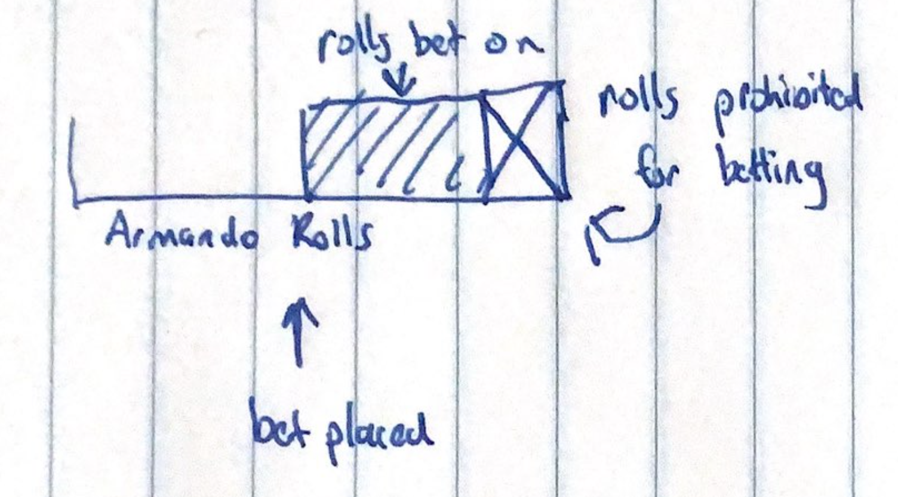

MIKES BOT USAGE GUIDE:

you are betting per roll that a character will be at or over 100ka. You get the prize ($checkprize) for every character at or over 100ka in the number of rolls you bet on. You pay the bet size per roll only on the characters that did not hit the 100ka mark. 

There are two types of bets: General and User-specific. General bets bet on the next 15 rolls from any user, whihc User-specific bets bet on a specific user's set of rolls. Since the bot tracks everyone's roll histories, you can bet on a particular person before or mid-way through each set of 15 rolls they do.

For example, if Armando is 7 rolls through a set of 15, you can bet on any of the remaining 7, and still be able to bet on as many of the next set of 15. However, you will bever be able to place 2 bets on Armando within his rolls. However, if you do place a halfway through Armando's rolls, you can place another bet on Brittany's rolls immediately after your Armando bet concludes, with no requirement to wait a full 15 Armando rolls. Here is a diagram to explain: 

to bet: $bet [number of rolls to bet on (2-20)] [bet size per roll (2-100)] [offset (optional)]
    note: offset is the number of rolls to skip before betting starts. For example, $bet 5 4 10 means "wait 10 rolls, then bet 4 per on the next 5 rolls"

to cancel a bet: $betcancel 
    note: can only be done if no rolls were done between you sending $bet and $betcancel

to check balance: $checkbalance

to check leaderboard: $checkbalances

to check the prize: $checkprize [roll #] [bet size] 
   note: not limited in the same way as bet so you can go wild with values 
